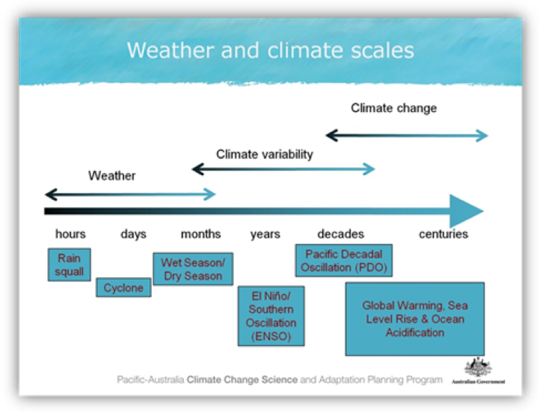

# (PART) Assessments {.unnumbered}

# Assessment 2A - Rainfall and streamflow data analysis {.unnumbered}

In this assessment we will explore the nature of rainfall and runoff data. Rainfall is influenced by a number of processes that operate on different space and time scales (see Figure \@ref(fig:image6)). We first examine these during this exercise and then we explore how different modes of climate variability affect patterns in annual rainfall. Lastly, we look to see if we can find a relationship between rainfall and streamflow (assumed equal to runoff). To achieve this, we use a large number of weather stations across WA to quantify the variability of rainfall in space and time.

In this assignment you will work to explore data from an individual site. You will then share with class members the results from your site so we can build a more complete picture. We will be sharing our data using an online spreadsheet. Please make sure that you upload your data as soon as possible so that others can include it in their analysis.

<center>

```{r image6, echo=FALSE, fig.cap="A guide to the timescales applicable to weather, climate variability and climate change [Pacific Climate Futures](www.pacificclimatefutures.net).", out.width = '80%'}

```

</center>

## Objectives {#A2A_1 .unnumbered}

By the end of this assignment, you should:

-   Understand how and why rainfall may be changing over time and use statistics and regression to test this hypothesis.
-   Know how different modes of climate variability such as IOD and ENSO can affect annual rainfall.
-   Be able to elucidate the nature of the relationship between rainfall and streamflow.

## Temporal trends in rainfall {#A2A_2 .unnumbered}

Prior to starting this work, make sure you have completed the Exercise 1B activity.

1)  For your chosen site, calculate the trend in rainfall for the **last 5 years.** Copy and paste the annual totals from the PIVOT table (include the year and amount columns) into another sheet. Select the last 5 years of data and in DATA ANALYSIS start a REGRESSION. Input the data range. Select "**Line Fit Plots**". What did you find and what were you expecting? Is this long enough for a reliable trend? Is the relationship really linear -- discuss?

2)  Now, calculate the trend in rainfall for **all** years available at the site. Copy and paste the annual totals from the PIVOT table (include the year and amount columns) into another sheet. Select the all years of data and INSERT a SCATTER plot. Add a trend line and "**display the equation**" on the chart. Add the Pearson correlation coefficient (r^2^) value as well. Add the information for your site into Table \@ref(tab:table5) (and insert the other class data when you can).

<center>

```{r table5, echo=FALSE, message=FALSE, warning=FALSE}
library(knitr)
library(kableExtra)
options(kableExtra.html.bsTable = F, knitr.kable.NA = '')
table5 <- read.csv("tables/exercise1A/table5.csv", check.names=FALSE)
kable(table5,"html", escape = F, align = rep('c', 5), caption = "Bureau of Meteorology Automatic Weather Station data and station ID across WA and SWWA. Complete the table for each site.",
      bootstrap_options = "hover") %>%
  kable_styling(table1, bootstrap_options = "hover", "striped",
                full_width = F, position = "center",
                font_size = 12) %>%
  column_spec(1, width_min = "9em") %>%
  column_spec(2, width_min = "9em") %>%
  column_spec(3, width_min = "9em") %>%
  column_spec(4, width_min = "9em") %>%
  column_spec(5, width_min = "9em") %>%
  column_spec(6, width_min = "9em") %>%
  row_spec(1:25, background = 'white') %>%
  scroll_box(width = "100%", height = "515px",
             fixed_thead = FALSE)
```

</center>

<br>

3)  What hypothesis can we make about changes in rainfall amount over time? How do we frame the hypothesis? What statistical test can we use to test the significance of the hypothesis? Describe the results and conclusions of this analysis. Calculate the appropriate t-value and p-value and enter them also into Table \@ref(tab:table5).

4)  Inspect the results of Table \@ref(tab:table5). Which station(s) have a statistically significant slope. Are there statistically significant changes in rainfall? Are they consistent across WA? What may be causing the changes?

## Spatial patterns in rainfall {#A2A_3 .unnumbered}

5)  Take the information in Table \@ref(tab:table4) and record the values onto a map of Western Australia. Now think about the spatial patterns rather than the temporal ones (i.e climate modes). What spatial patterns might you expect and what do you notice? What may be causing these spatial patterns?

<center>

```{r image7, echo=FALSE, fig.cap="", out.width = '90%'}
knitr::include_graphics("images/exercise1A/image6.png")
```

</center>

## Interannual variability in rainfall {#A2A_4 .unnumbered}

Here we determine how rainfall correlates with known modes of climate variability (i.e. Indian Ocean Dipole (IOD) and El Nino Southern Oscillation (ENSO)).

Other indicators of temporal variability (look for cyclic patterns). Does rainfall correlate with known modes of climate variability (i.e. IOD and ENSO using the Southern Oscillation Index (SOI)). SOI is calculated as follows.

<center>

```{=tex}
\begin{equation}
\text{SOI} = 10 \frac{P_{\text{diff}} - P_{\text{diffav}}}{SD(P_{\text{diff}})}
(\#eq:exercise-3)
\end{equation}
```
</center>

Where:

-   $P_{\text{diff}}$ = (average Tahiti MSLP for the month) - (average Darwin MSLP for the month)
-   $P_{\text{diffav}}$ = long term average of $P_{\text{diff}}$ for the month in question, and
-   $SD(P_{\text{diff}})$ = long term standard deciation of $P_{\text{diff}}$ for the month in question.

IOD is calculated by anomalous Sea Surface Temperature gradient between the western equatorial Indian Ocean (50E-70E and 10S-10N) and the south eastern equatorial Indian Ocean (90E-110E and 10S-0N) in units of degrees Kelvin.

We will use the extremely useful [Climate Explorer](https://climexp.knmi.nl/start.cgi?id=someone@somewhere) for the next section. First you will need to register so you can save data series. Access the rainfall from the previous site that you used in the previous section. Click on "**Monthly Station Data**" (right hand menu), select "precipitation" from the "GHCN-M (all)" column, search for your station (e.g. type BROOME in the "Select stations" section), and then press "Get stations". If the selection works you will see relevant stations listed, and then click "**get data**". You will then see graphs and options for further integrating the data. Make a name to save the data (the default should be fine). Click "**Add to list**".

<center>

<video width="85%" height="85%" controls>

<source src="images/exercise1A/video4.mp4" type="video/mp4">

</video>

</center>

Now get the first climate index for the IOD called the DMI. Go to "**Monthly climate indices**" and then select DMI. Note any trend and variability in the index.

To correlate the index and rainfall select "**Correlate with other time series**". And tick your previously saved rainfall timeseries and then press "**Correlate**" and copy the results into Table \@ref(tab:table6).

<center>

<video width="85%" height="85%" controls>

<source src="images/exercise1A/video5.mp4" type="video/mp4">

</video>

</center>

<br>

<center>

```{r table6, echo=FALSE, message=FALSE, warning=FALSE}
library(knitr)
library(kableExtra)
options(kableExtra.html.bsTable = F, knitr.kable.NA = '')
table6 <- read.csv("tables/exercise1A/table6.csv", check.names=FALSE)
kable(table6,"html", escape = F, align = rep('c', 5), caption = "Rainfall and climate indices (DMI for IOD and SOI for ENSO) correlations.",
      bootstrap_options = "hover") %>%
  kable_styling(table1, bootstrap_options = "hover", "striped",
                full_width = F, position = "center",
                font_size = 12) %>%
  column_spec(1, width_min = "12em") %>%
  column_spec(2, width_min = "12em") %>%
  column_spec(3, width_min = "12em") %>%
  column_spec(4, width_min = "12em") %>%
  column_spec(5, width_min = "12em") %>%
  row_spec(1:12, background = 'white') %>%
  scroll_box(width = "100%",
             fixed_thead = FALSE)
```

</center>

<br>

6)  Highlight any months that have a significant p-value (\<0.05). What relationships do you see between rainfall and climate mode and why? Do they correlate in specific seasons? How strong are these correlations really? How are they consistent or different across WA?

We can do the same exercise except using gridded data (climate data divided into say 0.5 degree spacing using reanalysis information). Click on "**Monthly observations**" and go to **Precipitation CRU TS 0.5**.

<center>

<video width="85%" height="85%" controls>

<source src="images/exercise1A/video6.mp4" type="video/mp4">

</video>

</center>

We then want to correlate each grid cell on the earth with our climate index (SOI and DMI) to see how the correlations very spatially. Click on "Correlate with a time series" and choose either SOI or DMI. Then click correlate at the bottom and wait (the calculations are being done online and the graph returned for viewing). Do the same for both SOI and DMI.

7)  For DMI which month had the highest (negative) correlation (copy that plot to your results). What areas of Australia have significant correlations and what time of year? For SOI which month had the highest (positive) correlation (copy that plot to your results). What areas of Australia have significant correlations and what time of year? Does this match with your own rainfall station correlations?

## Relationship between rainfall and runoff {#A2A_5 .unnumbered}

Now lets examine the relationship between annual rainfall and annual streamflow (also called discharge by surface hydrologists). Go to the [Department of Water](http://wir.water.wa.gov.au/Pages/Water-Information-Reporting.aspx) web site and download the streamflow data closest to your rainfall stations to examine this relationship (Refer to the Exercise 1B activity for details on how to source the data).

8)  Plot a scatter plot of annual streamflow (y-axis) and annual rainfall (x-axis). Add a trendline to the chart. What are the relationships between rainfall and streamflow? Are they linear or non- linear and why? Are they consistent across WA?

## Submission {#A2A_6 .unnumbered}

Your submission for this assessment is a summary report outlining the results of the analysis and questions posed in questions 1-8, above. This should include the figures and tables you created, summarising the data from your chosen site and the broader class data-set.
