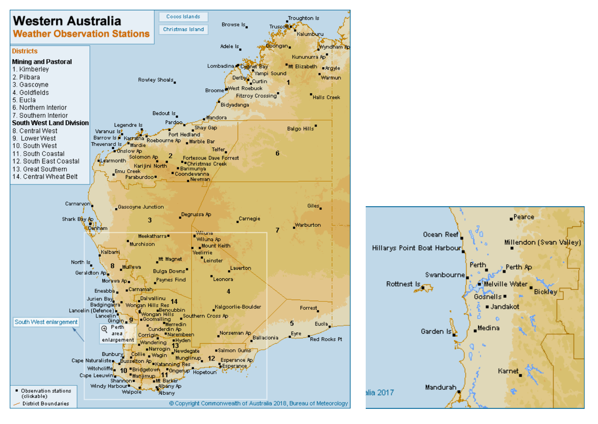

# Exercise 1 - Understanding rainfall and streamflow data {.unnumbered}

## Introduction {#E1_1 .unnumbered}

In this exercise we will learn how to access rain and flow data, and examine the nature of these data and using Excel. We will also investigate links between modes of climate variablity and the measured data.

## Learning Objectives {#E1_2 .unnumbered}

By the end of this exercise learners will be able to:

-   Access rainfall and streamflow data from publicly available data sources
-   Describe the nature of that data using simple statistics in Excel.
-   Explain how and why rainfall and streamflow may be changing over time
-   Investigate how climate variability affects annual rainfall and streamflow.


## Getting Rainfall Data {#E1_3 .unnumbered}

Start by downloading the daily rainfall data for a chosen BOM site from the [Bureau of Meteorology](http://www.bom.gov.au/climate/data/){target="_blank”} web site. Choose a site of interest in Western Australia. Use the site ID to get the data as below. Download and extract the zipped file to get a CSV file that can be opened in Excel. Once you've opened it save it as a .xlsx file so that it has full functionality in Excel.

<center>

<video width="100%" height="100%" controls>

<source src="images/exercise1A/video1.mp4" type="video/mp4">

</video>

</center>

## Statistical Properties of Rainfall Data {#E1_4 .unnumbered}

Now, let's plot the time series of DAILY rainfall.  Consider: what is the most appropriate type of graph for rainfall data (bar, scatter, line)? The default chart formatting in Excel should be improved manually after plotting (axis labels, tick marks etc). How would you describe the main features of this data set. 

Now let's investigate what's happening with annual rainfall amounts. First, we want to ensure that there are only whole years to calculate the sums or else the incomplete years will be in error (the sum will be artificially low due to missing data). Delete the rows of data for the last partial year (e.g., 2021) and any partial years at the start (the first and last year measured may change depending on the site you selected). Now we can use a PIVOT table to explore annual trends. Select the required data columns (year C to rainfall amount F). Then insert PIVOT table (select "Create a new tab"). Select Year and Rainfall amount as the FIELDS. Drag the Year FIELD into the ROWS box. Left click on the "Sum of Year" in the VALUES box and remove it. Plot the annual sums as a timeseries. You can also select "COUNT" in the SUM VALUES box to see how many entries are given for each. Years with more than 10% of days missing, are unreliable to include in our analysis so see if your station has any incomplete years. Clean up the plot with the sum of rainfall as required plot the data (you may want to copy the values and paste them outside of the Pivot Table so you have more flexibility). What are the main features of this annual data set? What variability can you see?

Now we have a "clean" dataset, we want to explore some statistics. Use the Data Analysis add-in to calculate descriptive statistics (mean annual rainfall, max annual rainfall, min annual rainfall, Standard deviation of annual rainfall, Skewness) for the whole data (you can install by going to *Tools-\>Add-ins-\>Analysis ToolPack*).  Describe the values you got and what they mean. How "useful" are these statistics for your understanding of the system? What if any assumptions are there about these statistics?

<!-- #<!-- Old link: --> -->
<!-- # -->
<!-- #<!-- https://docs.google.com/spreadsheets/d/10mHrNWEHoqWif96e7SwvowfQ7sMg_qMxFtw6POr7#sG4/edit?usp=sharing --> -->

Next, let's look at the distribution of the rainfall data. Do this by plotting a histogram of the rainfall data (you will need to decide on a reasonable bin size) and plotting the cumulative probability distribution (you can ask Excel to generate this automatically when it makes the histogram, or generate it manually -- each data point represents a probability of 1/\#data points). What do these plots tell you about the rainfall data? Are the data normally distributed?

Now let's see what the seasonal varation is. Use a PIVOT table to calculate the sum (or average) rainfall across each month. Insert PIVOT table (select OK to create a new tab). Select **Month** and **Rainfall** amount as the FIELDS; drag the Month FIELD into the ROWS box. Left click on the "Sum of Month" in the VALUES box and remove it. Plot the monthly sums as a timeseries. How would you describe the seasonal pattern of rainfall (hint look at the climate type)? What factors may influence it?

<center>

```{r table4, echo=FALSE, message=FALSE, warning=FALSE}
library(knitr)
library(kableExtra)
options(kableExtra.html.bsTable = F, knitr.kable.NA = '')
table4 <- read.csv("tables/exercise1A/table4.csv", check.names=FALSE)
kable(table4,"html", escape = F, align = rep('c', 5), caption = "Bureau of Meteorology Automatic Weather Station data and station ID across WA and SWWA.",
      bootstrap_options = "hover") %>%
  kable_styling(table4, bootstrap_options = "hover", "striped",
                full_width = F, position = "center",
                font_size = 12) %>%
  column_spec(1, width_min = "10em") %>%
  column_spec(2, width_min = "10em") %>%
  column_spec(3, width_min = "10em") %>%
  column_spec(4, width_min = "10em") %>%
  column_spec(5, width_min = "10em") %>%
  column_spec(6, width_min = "10em") %>%
  row_spec(1:25, background = 'white') %>%
  scroll_box(width = "100%", height = "515px",
             fixed_thead = FALSE)
```

</center>

## Temporal trends in rainfall {#E1_5 .unnumbered}

For your chosen site, calculate the trend in rainfall for the **last 5 years.** Either copy and paste the annual totals from the PIVOT table (include the year and amount columns) or calculate them manually. Select the last 5 years of data and in DATA ANALYSIS start a REGRESSION. Input the data range for x (the independant variable) and y (the dependant variable). Select "**Line Fit Plots**". What did you find and what were you expecting? Is this long enough for a reliable trend? Is the relationship really linear -- discuss? (You can do this same analysis by adding a trend-line to the data, as described below).

Now, calculate the trend in rainfall for **all** years available at the site. You can calculate that annual total rainfall using a PIVOT table (include the year and amount columns) or by calculating them manually using SUM. Select the all years of data and INSERT a SCATTER plot. Add a linear trend line and "**display the equation**" on the chart. The slope of the equation of the line tells you the trend. Add the Pearson correlation coefficient (r^2^) value as well to see how well the line fits the data (1 is a perfect fit, 0 is no fit). Add the information for your site into the online Table \@ref(tab:A2Atable1) [online spreadsheet](https://docs.google.com/spreadsheets/d/129fkRd6_oI1KFyql8QunjKeDBx47WU1lduWMFms5N_s/edit?usp=sharing){target="_blank”}.

<center>

```{r A2Atable1, echo=FALSE, message=FALSE, warning=FALSE}
library(knitr)
library(kableExtra)
options(kableExtra.html.bsTable = F, knitr.kable.NA = '')
table1 <- read.csv("tables/assessment_2A/table1.csv", check.names=FALSE)
kable(table1,"html", escape = F, align = rep('c', 5), caption = "Bureau of Meteorology Automatic Weather Station data and station ID across WA and SWWA. Complete the table for each site.",
      bootstrap_options = "hover") %>%
  kable_styling(table1, bootstrap_options = "hover", "striped",
                full_width = F, position = "center",
                font_size = 12) %>%
  column_spec(1, width_min = "9em") %>%
  column_spec(2, width_min = "9em") %>%
  column_spec(3, width_min = "9em") %>%
  column_spec(4, width_min = "9em") %>%
  column_spec(5, width_min = "9em") %>%
  column_spec(6, width_min = "9em") %>%
  row_spec(1:25, background = 'white') %>%
  scroll_box(width = "100%", height = "515px",
             fixed_thead = FALSE)
```

</center>

<br>

Looking at the plot of rainfall over time at your site, what hypothesis can we make about changes in rainfall amount over time? Using the full temporal dataset (all years), perform a REGRESSION analysis like you did in the first question. These results will inclue a t-statistic (t Stat) and P-value, enter them also into Table \@ref(tab:A2Atable1). The null hypothesis is that the rainfall did NOT change over time. If the P-value is smaller than alpha = 0.05 then we can REJECT the null hypothesis (which means that the rainfall amount has changed significantly over time). You can also reject the null hypothesis if the t-statistic is less than -2.101 or greater than 2.101 (based on a normal distribution). Describe the results and conclusions of this analysis.

Inspect the results of everyone's analysis for Table \@ref(tab:A2Atable1) ([Google Sheets version](https://docs.google.com/spreadsheets/d/129fkRd6_oI1KFyql8QunjKeDBx47WU1lduWMFms5N_s/edit?usp=sharing){target="_blank”}). Which station(s) have a statistically significant slope. Are there statistically significant changes in rainfall? Are they consistent across WA? What may be causing the changes?

## Spatial patterns in rainfall {#E1_6 .unnumbered}

Take the information in Table \@ref(tab:table4) ([Google Sheets version](https://docs.google.com/spreadsheets/d/129fkRd6_oI1KFyql8QunjKeDBx47WU1lduWMFms5N_s/edit?usp=sharing){target="_blank”}) and record the values onto a map of Western Australia. Now think about the spatial patterns rather than the temporal ones (i.e climate modes). What spatial patterns might you expect and what do you notice? What may be causing these spatial patterns?

<center>

```{r A2Aimage2, echo=FALSE, fig.cap="", out.width = '90%'}

```

</center>

## Getting Streamflow Data {#E1_7 .unnumbered}

Streamflow data is recently reported on the BOM website for some rivers, but the measurement of streamflow is a State Government responsibility. To get streamflow data, go the [Department of Water](http://wir.water.wa.gov.au/Pages/Water-Information-Reporting.aspx) web site. Use this WIR tool to locate a gauging station near your rainfall site. To filter the sites shown on the map you can choose "Stream Gauging" as your site category and "Water level-flow - TS archive" as the data category (TS stands for time-series) and click the "Apply" button. If you have multiple guages to choose from then check how much data is available by right-clicking on the point and then choosing "Basic site data availability summary". Ideally, your station would have 10-20 years of available data for this exercise. 

Once you've chosen your the gauging station you want to use, then click on add the site to your cart and submit a data request. For streamflow data measured by a data logger (rather than manual measurements) you should request "Water levels/flow (continuous) for Site(s) cross-tabulated". You will then be emailed a zip file with the station's data. 

<center>

<video width="85%" height="85%" controls>

<source src="images/exercise1A/video3.mp4" type="video/mp4">

</video>

</center>

Once you have the data, explore the CSV file received to see the nature of the data provided - i.e., river flow discharge rate. Can you use the techniques introduced above to summarise the data (e.g., create a PIVOT table)?

Now you know how to source some essential water data, and summarise it in an easy to use fashion. What else could we do to explore the data? Generate some plots that you could use to explain the key features of the data to someone.


## Relationship between rainfall and streamflow {#E1_8 .unnumbered}

Now lets examine the relationship between annual rainfall and annual streamflow (also called discharge by surface hydrologists). Go to the [Department of Water](http://wir.water.wa.gov.au/Pages/Water-Information-Reporting.aspx){target="_blank”} web site and download the streamflow data closest to your rainfall stations to examine this relationship.

Plot a scatter plot of annual streamflow (y-axis) and annual rainfall (x-axis). Add a trendline to the chart. What are the relationships between rainfall and streamflow? Are they linear or non-linear and why? Add the data for your site to the [online spreadsheet](https://docs.google.com/spreadsheets/d/129fkRd6_oI1KFyql8QunjKeDBx47WU1lduWMFms5N_s/edit?usp=sharing){target="_blank”} so we can look at the whole data set - are there consistent relationships across WA? If not, explain the variation.

## Linking rainfall and streamflow to climate variability {#E1_9 .unnumbered}

Now let's will explore the link between climate modes and the rainfall and runoff data. Rainfall is influenced by a number of processes that operate on different space and time scales (see Figure \@ref(fig:A2Aimage1)).

<center>

```{r A2Aimage1, echo=FALSE, fig.cap="A guide to the timescales applicable to weather, climate variability and climate change [Pacific Climate Futures](www.pacificclimatefutures.net).", out.width = '80%'}
knitr::include_graphics("images/assessment_2A/image1.png")
```

</center>

In this section we will determine how rainfall correlates with known modes of climate variability (i.e. Indian Ocean Dipole (IOD) and El Nino Southern Oscillation (ENSO). 

We can investigate ENSO using the Southern Oscillation Index (SOI), which is calculated as:

<center>

```{=tex}
\begin{equation}
\text{SOI} = 10 \frac{P_{\text{diff}} - P_{\text{diffav}}}{SD(P_{\text{diff}})}
(\#eq:A2Aequation1)
\end{equation}
```
</center>

Where:

-   $P_{\text{diff}}$ = (average Tahiti MSLP for the month) - (average Darwin MSLP for the month)
-   $P_{\text{diffav}}$ = long term average of $P_{\text{diff}}$ for the month in question, and
-   $SD(P_{\text{diff}})$ = long term standard deciation of $P_{\text{diff}}$ for the month in question.

The IOD is calculated by anomalous Sea Surface Temperature gradient between the western equatorial Indian Ocean (50E-70E and 10S-10N) and the south eastern equatorial Indian Ocean (90E-110E and 10S-0N) in units of degrees Kelvin. This reflects similar phenomena to ENSO, but in the Indian Ocean. The intensidy of the IOD is indicated by the Dipole Mode Index (DMI)

We will use the extremely useful [Climate Explorer](https://climexp.knmi.nl/start.cgi?id=someone@somewhere){target="_blank”} for the next section. First you will need to register so you can save data series. Now you want to access the rainfall from the previous site that you used in the previous section. Click on "**Monthly Station Data**" (right hand menu), select "precipitation" from the "GHCN-M (all)" column, search for your station (e.g. type BROOME in the "Select stations" section), and then press "Get stations". If the selection works you will see relevant stations listed, and then click "**get data**". You will then see graphs and options for further integrating the data. Make a name to save the data (the default should be fine). Click "**Add to list**".

<center>

<video width="85%" height="85%" controls>

<source src="images/assessment_2A/video1.mp4" type="video/mp4">

</video>

</center>

Now get the first climate index for the IOD called the DMI. Go to "**Monthly climate indices**" and then select DMI. Note any trend and variability in the index.

To correlate the index and rainfall select "**Correlate with other time series**" from the RHS menu. And now tick your previously saved rainfall timeseries and then press "**Correlate**" and copy the results into Table \@ref(tab:A2Atable2) in the [online spreadsheet](https://docs.google.com/spreadsheets/d/129fkRd6_oI1KFyql8QunjKeDBx47WU1lduWMFms5N_s/edit?usp=sharing){target="_blank”}.

<center>

<video width="85%" height="85%" controls>

<source src="images/assessment_2A/video2.mp4" type="video/mp4">

</video>

</center>

<br>

<center>

```{r A2Atable2, echo=FALSE, message=FALSE, warning=FALSE}
library(knitr)
library(kableExtra)
options(kableExtra.html.bsTable = F, knitr.kable.NA = '')
A2Atable2 <- read.csv("tables/assessment_2A/table2.csv", check.names=FALSE)
kable(A2Atable2,"html", escape = F, align = rep('c', 5), caption = "Rainfall and climate indices (DMI for IOD and SOI for ENSO) correlations.",
      bootstrap_options = "hover") %>%
  kable_styling(table1, bootstrap_options = "hover", "striped",
                full_width = F, position = "center",
                font_size = 12) %>%
  column_spec(1, width_min = "12em") %>%
  column_spec(2, width_min = "12em") %>%
  column_spec(3, width_min = "12em") %>%
  column_spec(4, width_min = "12em") %>%
  column_spec(5, width_min = "12em") %>%
  row_spec(1:12, background = 'white') %>%
  scroll_box(width = "100%",
             fixed_thead = FALSE)
```

</center>

<br>

In the online spreadsheet, highlight any months that have a significant p-value (\<0.05). What relationships do you see between rainfall and climate mode and why? Do they correlate in specific seasons? How strong are these correlations really? How are they consistent or different across WA?

What if we want to look at the whole of Australia, not just one meteorology station? We can do the same exercise except using gridded data (climate data divided into say 0.5 degree spacing using reanalysis information) to investigate the whole of Australia. Click on "**Monthly observations**" and go to **Precipitation CRU TS 0.5**.

<center>

<video width="85%" height="85%" controls>

<source src="images/assessment_2A/video3.mp4" type="video/mp4">

</video>

</center>

We then want to correlate each grid cell on the earth with our climate index (SOI and DMI) to see how the correlations very spatially. Click on "Correlate with a time series" and choose either SOI or DMI. Then click correlate at the bottom and wait (the calculations are being done online and the graph returned for viewing). Do the same for both SOI and DMI.

For DMI which month had the highest (negative) correlation. What areas of Australia have significant correlations and what time of year? For SOI which month had the highest (positive) correlation. What areas of Australia have significant correlations and what time of year? Does this match with your own rainfall station correlations?

## Reporting on scientific data {#E1_10 .unnumbered}

There are two common ways that scientific analysis is communicated in the workplace; through oral presentations and written reports. In this unit your will develop your skills in both of these communication styles. For this exercise, let's think about how these approaches might differ.

Let's say you were asked to prepare a written report summarizing your analysis and findings.

-   What would the sections of your report be?

-   How long do you think your report would end up being?

-   What figures or tables would you include?

Now let's think about a 15 minute presentation. How would this be different to your written report?

-   What would the sections of your talk be?

-   What figures or tables would you include?
